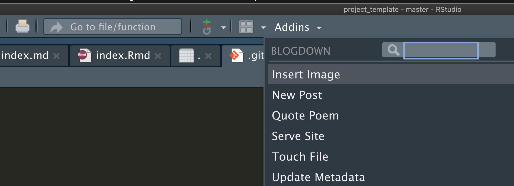

This file is from `content/post/2021-02-09-example/index.Rmd`. I made it by running `blogdown::new_post("example", ext = ".Rmd")` in the console.

Note that images like the one above are stored in `static/images` in your project folder.

## Just like an RMarkdown

Show code ...


```{r, message=FALSE}
library(tidyverse)
msleep %>%
  group_by(vore) %>%
  summarize(`average body weight` = mean(bodywt))

ggplot(msleep, aes(x = bodywt, y = vore)) + geom_col()
```

<br>

... or a nicer table ...

```{r, echo=FALSE}
msleep %>%
  group_by(vore) %>%
  summarize(`average body weight` = mean(bodywt)) %>%
  knitr::kable()
```

... or make a plot.

```{r, fig.cap = "Wow captions too!"}
ggplot(msleep, aes(x = sleep_total, y = bodywt)) +
  geom_point() + scale_x_log10() + scale_y_log10()
```

I can even put in some math $e^x$ or a displayed equation
$$e^{\pi i} + 1 = 0.$$


---

# Creating a new post

To create a new post you can run

```{r, eval=FALSE}
blogdown::new_post("Post title", ext = ".Rmd")
```

Alternatively, you can use the "Addins" menu.



Just make sure to select `.Rmd` for the format so you can include and run `R` code.


---

## I can't see my updates

When you want to see how the changes or additions you made will look on the website, you need to run `blogdown::serve_site()` which will knit Rmd files as they change and create a local web server that you can use to preview the site.

If you are not seeing the changes you were hoping for:

1. Check to make sure you are not getting any knitting errors. In the Console, you might something like 
`Error : Failed to render content/post/2021-02-09-example/index.Rmd`
You should look above that for any errors. Usually it will say something like `Quitting from lines 83-84 (index.Rmd)` which can help you to isolate where the error is. (Note, it might not be in the file you have been editing if an error was introduced by a team mate).

2. If you don't see any errors, it might be that `serve_site()` hasn't yet recognized the changes you've made. To force it to compile you can add a small change to the .Rmd files, like a line break. This will update the modification time on the file which should cause the file to be knitted. Another option is to use Addins -> Touch File (see screenshot above).
